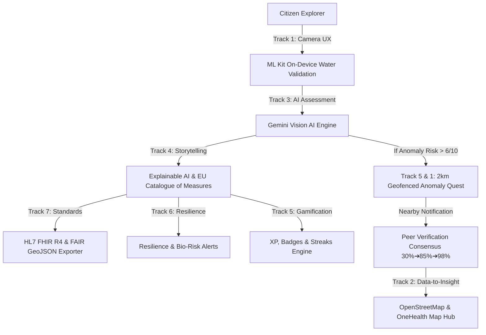

# 🌊 AquaQuest AI V2 — Gamified Mobile Citizen Science & European OneHealth Stream Guardian

[](https://oneaquahealth-ieee-hackathon.devpost.com/)
[](https://www.oneaquahealth.eu/)
[](https://developer.android.com/)
[](https://hl7.org/fhir/)

> **IEEE OneAquaHealth Global Hackathon 2026 Submission**  
> **Tagline:** *From streams to systems: turning citizen science and real-time telemetry into actionable One Health intelligence.*

---

## 📌 Executive Summary & Problem Statement

Urban freshwater ecosystems (rivers, streams, canals, wetlands) are crucial indicators of ecological stability and human public health. However, monitoring urban aquatic health faces three critical bottlenecks:
1. **High Usability & Jargon Barrier:** Traditional citizen science tools require complex ecological jargon (e.g., Nephelometric Turbidity Units, dissolved oxygen saturation, macroinvertebrate indices), alienating everyday citizens.
2. **Low Retention & Drop-off:** Existing apps lack long-term engagement mechanics. Over 80% of users submit 1 observation and never engage again.
3. **Unverified Data & Lack of Interoperability:** Crowdsourced observations are often unverified, isolated, and fail to translate environmental risk into clear **One Health** impact on humans, domestic pets, and local wildlife.

### 🏆 The Winning Solution: AquaQuest AI V2
**AquaQuest AI V2** transforms urban stream monitoring into an immersive, gamified **Community Guardian Quest** grounded in the **5 European Pilot Cities** of the EU OneAquaHealth project (**Coimbra 🇵🇹, Gent 🇧🇪, Benevento 🇮🇹, Oslo 🇳🇴, Toulouse 🇫🇷**) and integrated with live **USGS Water Data API** (`api.waterdata.usgs.gov`) telemetry.

---

## 🎯 The 7-Track Fusion Strategy

While most hackathon projects address only 1 or 2 isolated tracks, **AquaQuest AI V2** unifies **all 7 hackathon tracks** into a single cohesive platform:



| Track | Challenge Addressed | How AquaQuest V2 Solves It |
| :--- | :--- | :--- |
| **Track 1: Citizen Science UX** | Usability barriers & jargon | CameraX viewfinder with real-time HUD overlays, ML Kit horizon leveler, and plain-English status terms. |
| **Track 2: Data-to-Insight** | Fragmented stream data | OpenStreetMap hub with vector river channels, stream health heatmaps, and One Health risk dashboards. |
| **Track 3: AI-Supported Assessment** | Inconsistent observations | Dual-layer AI engine: On-device ML Kit image check + Gemini 1.5 Vision for WFD status and risk scoring. |
| **Track 4: Awareness & Storytelling** | Complex bio-indicators | 🧠 AquaQuest AI Assessment providing evidence-based safety indicators for domestic pets, swimming, and fish habitats. |
| **Track 5: Community & Gamification** | Low repeat engagement | Geofenced Anomaly Quests (<2 km proximity alerts), XP leveling (*Stream Scout* ➔ *Master HydroGuardian*), and 3D badges. |
| **Track 6: Resilience Informatics** | Lack of predictive tools | Early warning bio-hazard alerts, cyanobacteria bloom warnings, and municipal mitigation recommendations. |
| **Track 7: Digital Health Standards** | Fragmented schemas | 1-tap **HL7 FHIR `Observation` R4** JSON generator with LOINC codes (`21612-7`, `2748-2`) & ISO 19115 GeoJSON exporter. |

---

## 🌍 European Pilot Cities Grounding

AquaQuest AI V2 is pre-configured with spatial coordinates, river networks, and baseline ecological stressors for the **5 official European Pilot Cities** of the OneAquaHealth Horizon Europe consortium:

* 🇵🇹 **Coimbra, Portugal (Mondego River Basin):** Monitoring summer cyanobacteria blooms, stream warming, and pharmaceutical runoff.
* 🇧🇪 **Gent, Belgium (Scheldt & Leie Canals):** Tracking urban heat island stream degradation, micro-plastics, and hydrocarbon sheens.
* 🇮🇹 **Benevento, Italy (Calore & Sabato Rivers):** Addressing agricultural sediment turbidity and benthic macroinvertebrate loss.
* 🇳🇴 **Oslo, Norway (Akerselva River):** Monitoring sub-arctic cold-water bio-indicators and seasonal storm surges.
* 🇫🇷 **Toulouse, France (Garonne & Touch Streams):** Early warning alerts for summer drought stream drying and mosquito vector risks (*Aedes albopictus*).

---

## 🌊 USGS Water Data API Integration (`api.waterdata.usgs.gov`)

AquaQuest V2 integrates real-time telemetry from the **USGS Water Data API** (`api.waterdata.usgs.gov`):

* **Live Search Bar:** Users search any US city or station (e.g., *Austin*, *Denver*, *New York*, *Hudson River*).
* **Comprehensive Hydrographic Telemetry:** Streamflow Discharge (`cfs` & `m³/s`), Stage Level (`ft`), Water Temp (`°C` & `°F`).
* **Chemical & Physical Quality:** pH Balance, Specific Conductance (`µS/cm`), Turbidity (`NTU`), Dissolved Oxygen (`mg/L` & `% Saturation`), Total Dissolved Solids (`ppm`).
* **Dedicated Detail Screen (`UsgsWaterDetailScreen.kt`):** Tapping the result card opens a Light Mode detailed analysis page featuring plain-English pet/swimming guides, 🧠 AquaQuest AI Assessment, and HL7 FHIR R4 JSON export.

---

## 🛠️ Architecture & Technology Stack

* **Language & Framework:** Kotlin 1.9+, Native Android SDK (Min API 26+)
* **UI Framework:** Jetpack Compose with Material 3 (Fresh Eco Light Mode Design System)
* **Architecture Pattern:** MVVM (Model-View-ViewModel) + Offline-First Repository Pattern
* **Local Persistence:** Room Database for offline observation caching & quest state
* **Mapping Engine:** OpenStreetMap (osmdroid) + Overpass Vector River Query Engine
* **AI & Machine Learning:** Google ML Kit Vision (On-Device) + Gemini 1.5 Vision API + Groq Llama-3 🧠 AquaQuest AI Assessment
* **Interoperability & Standards:** HL7 FHIR `Observation` R4 JSON Exporter + LOINC Codes (`21612-7`, `2748-2`) + GeoJSON 1.0 (ISO 19115)
* **Network & Data:** HttpURLConnection / OkHttp with JSON parsing

---

## 🚀 Building & Running Locally

### Prerequisites
- Android Studio Ladybug / Koala or Android CLI environment
- Android SDK 34 (Android 14)
- JDK 17+
- Android Device or Emulator connected via ADB

### Build & Deploy Commands
```bash
# Clone the repository
git clone https://github.com/your-org/AquaQuestAI.git
cd AquaQuestAI/app

# Compile Kotlin source code
./gradlew compileDebugKotlin

# Assemble Debug APK
./gradlew assembleDebug

# Install and Launch on connected ADB device/emulator
./gradlew installDebug
adb shell am start -n com.example.aquaquestai/.MainActivity
```

---

## 📋 Evaluation & Judging Criteria Alignment

| Judging Criterion | Weight | How AquaQuest AI V2 Achieves the Top Score |
| :--- | :--- | :--- |
| **Impact & OneAquaHealth Mission** | 25% | Connects stream water quality metrics directly to human, pet, and ecosystem health warnings across 5 EU pilot cities. |
| **Innovation & Creativity** | 25% | Dual AI inspection (ML Kit + Gemini Vision) paired with 2km Geofenced Anomaly Peer Verification Quests (30% ➔ 85% ➔ 98% consensus). |
| **Architecture & Technical Depth** | 20% | Clean MVVM Native Android + Room DB + OpenStreetMap vector river channels + USGS Water API integration. |
| **UX & Usability** | 15% | High-contrast Light Mode design, zero ecological jargon, relatable terms (*Water Flow Speed*, *Oxygen for Fish*), rewarding haptics. |
| **Scale & Interoperability** | 15% | 1-tap **HL7 FHIR R4** Observation JSON & **ISO 19115 GeoJSON** exports ready for ingestion by EU Open Information Hubs. |
